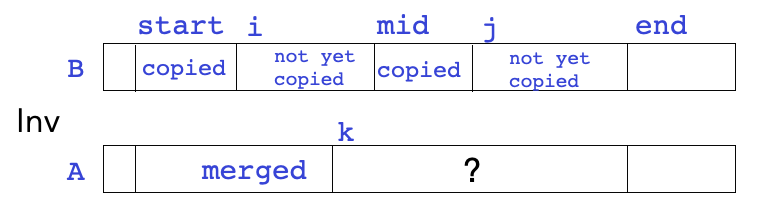

# Exercises - Lecture 5

### 5A

1. Execute mergesort on the following array. Write the state of the array after the completion of all merges of size 1 subarrays, then after the completion of all merges of size 2 subarrays, and so on until the array is sorted. Note that this is out of order from how it would be executed recursively - that's fine; we're only going for a conceptual understanding of the steps here.

   ```
   A = new int[]{8, 7, 5, 8, 6, 9, 2, 4}
   ```

   

### 5B

2. What is the precondition for the merge method, and why is it necessary?

3. Do the two sub-arrays to be merged need to be the same length? Why or why not?

4. Recall the diagram I drew to describe the loop invariant:

   

   Give an expression for the value of `k` in terms of `i`, `j`, and `mid`.

### 5C

5. What is the worst-case runtime of mergesort on an array of size $n$?

