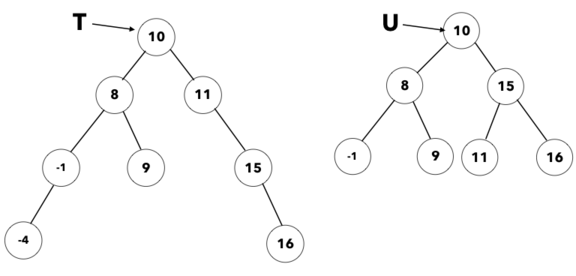

# Exercises - Lecture 10

### 10B

Consider the following binary tree:

1. What is the height of:
   * The whole tree?
   * 15's left subtree?
   * 15's right subtree?
   * 16's left subtree?
2. What is the balance factor of
   * Node 16?
   * Node 15?
   * Node 10?

3. In each of the following trees, which node has the balance factor with the largest absolute value?

   

   * **T**:
   * **U**:

### 10C

Here's the same tree we worked with in #1-2 again. Draw the result of performing each of the following rotations, beginning with the original tree each time.

4. Left rotate on the node with value 11.

5. Left rotate on the node with value 15.

6. Right rotate on the node with value 15.

   

