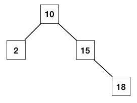

# Exercises - Lecture 11

### 11A

1. Which of the following are **not** AVL trees?

   

### 11B

2. This problem walks through one example of AVL insertion.

   a. Draw the following BST after `18` is inserted using BST insert (i.e., no rebalancing yet).

   

   b. In the resulting tree, label heights and balance factors of each node.

   c. If we're doing AVL insert, the recursion will walk back up the tree after the new node is inserted, calling `rebalance` on each parent node in succession. What nodes have `rebalance` called on them, and in what order?

   d. Which call(s) to `rebalance` result in rotations? What are the rotations? For each `rebalance` call that modifies the tree, draw the tree after the appropriate rotations are performed.

3. Repeat the same four subproblems from #2, but beginning with the following tree, and inserting the value 16 instead of 18.

   

