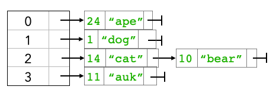

# Exercises - Lecture 15


### 15A

1. A hash table with capacity 40 has load factor 0.1. What is the minimum and maximum possible number of buckets "wasting" memory (i.e., buckets that do not contain any elements)?

2. Consider the following hash map with capacity 4:

   

   Grow the underlying array to size 6 and draw the new table with all entries rehashed into it.

3. Suppose you wanted to print a tabular representation of a hashmap, such as:

   ```
   24: "ape"
   1: "dog"
   14: "cat"
   10: "bear"
   11: "auk"
   ```

   Write pseudocode to do this.

### 15B

4. A hash map with capacity 10 uses linear probing for collision resolution. Draw the table after the following sequence of operations:

   ```java
   put(0, “ape”);
   put(1, “dog”);
   put(20, “elf”);
   put(21, “auk”);
   put(40, “bear”);
   put(41, “cat”);
   put(60, “elk”);
   put(61, “imp”);
   ```

5. Repeat the prior exercise, but using quadratic probing instead.

### 15C

6. T / F All non-primitive types in Java can be placed in a hash table because they have an implementation of `hashCode`.

