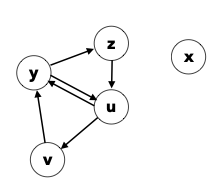
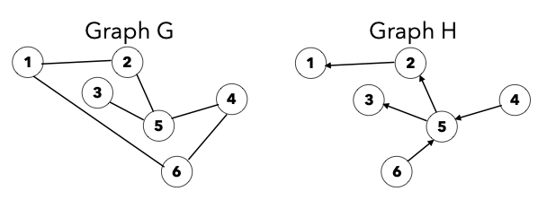

# Exercises - Lecture 16

### 16A

1. Draw a diagram of the following undirected graph:
   $$
   V = \{a, b, c, d, e\}
   $$
   $$
   E = \{(a, c), (d, a), (c, d), (a, e), (b, e)\}
   $$
   In the above graph, what is |E|?

2. Write the formal set-based representation for the following directed graph:

   

   In the above graph, what is |V|?

   For the following problems, refer to these two graphs G and H:

   

3. Is G acyclic?

4. Is there a path from 3 to 5 in G?

5. Is H directed?

6. Is (1, 2) an edge in H?

7. What is the degree of node 5 in G?

8. What is |V| in G?

9. What is |E| in H?

10. Is H strongly connected? Is H weakly connected?

### 16B

11. Draw the adjacency matrix representation for graph G above.

12. Draw the adjacency list representation for graph H above.

