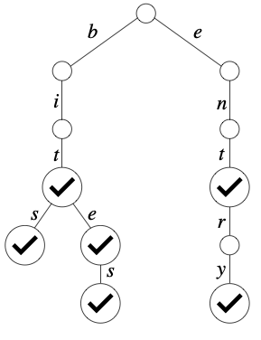
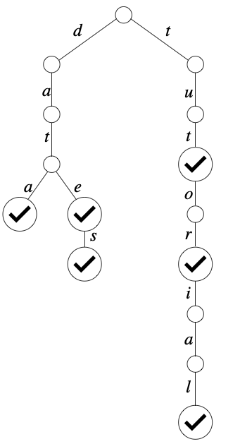

# Exercises - Lecture 19

**Goals**

* Know how to read a drawing of a Trie.
* Be able to run on paper and prepared to implement `insert`, `contains`, and `remove` operations on a Trie implementation of the Set and Map ADTs.

### 19A

1. List all the words stored in the following trie:

   

### 19B

2. Draw a trie implementing a set of Strings containing the following keys:

```
an
ant
ants
anti
and
go
goal
gold
goalie
zoo
zone
zones
```

3. Draw a trie implementation of a Map from integers (use base-10 digits as the symbols) to Strings resulting from the following sequence of operations:

   ```
   put(141, "Intro")
   put(145, "Java")
   put(241, "Data Structures")
   put(247, "Systems")
   put(301, "Formal/Functional")
   put(30, "Huh?")
   ```

4. Consider the following trie implementing a Set:

   
   
    Starting with this trie, do the following operations and draw the resulting trie:

  ```
  insert("ton")
  insert("tone")
  insert("tones")
  insert("tutoring")
  delete("data")
  delete("tut")
  delete("tones")
  delete("ton")
  ```

