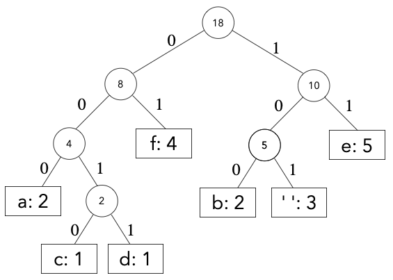

# Exercises - Lecture 20

### 20A

For the following several questions, use the following coding tree; note that the space character is written as `' '` for clarity:

1. How many characters were in the input?
2. How many *distinct* characters were in the input?
3. Decode the binary code `1001111011010111110011` 
4. Encode the string `bead`; for clarity, separate the codes for each distinct character with spaces.

### 20B

5. Let's build a coding tree for the input string: `kakakakangarrooo`
   1. Write down the table of character frequencies.
   
   2. Build a Huffman Coding Tree that minimizes the encoded length of the message.
   
      Ties may arise when deciding which of two equal-priority trees to pull out of the forest. Break these ties using the following rules:
   
      * Take the tree with fewer leaves first
      * If tied, take the tree with the earliest alphabetical leaf
   
      We also get to choose which tree goes to the left and right of its parent. Decide this as follows:
   
      * The lower-frequency tree is the left child of the parent
      * If tied, the tree with fewer leaves is the left child
      * If still tied, the tree with the earliest alphabetical leaf.
   
   3. Give the message's bitstring encoding; for clarity, separate the codes for each distinct character with spaces.
