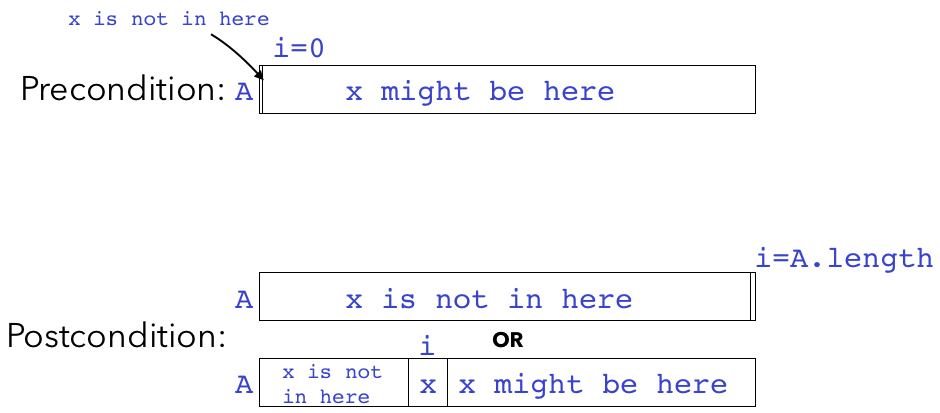

# Lecture 1 - Problems

Give the *number* of elements in each of the following ranges:

1. `0..x` (assume `x >= 0`)
2. `a..b` (assume `a <= b`)

Consider the following Java method:

```java
public static int linearSearch(int[] A, int x) {
  for (int i = 0; i < A.length; i++) {
    if (A[i] == x) {
      return i;
    }
  }
  return -1;
}
```

3. Determine what the code does and write a concise **method specification** for the method.

4. A good way to think about **preconditions** is as a way to avoid having to handle inputs that don't make sense. If a method can be called with syntactically correct inputs but nonetheless result in an error, the method should either handle that case explicitly, or have a precondition that says such an input is not allowed. Determine whether the method needs any preconditions; if so, list them; if not, explain why not.

5. Sometimes, a method's postcondition is very similar to the description already given in the specification, and we don't need to list it. In this case, let's be overly explicit and write a **postcondition** for the method.

6. Write a **loop invariant** for the `for` loop in the above code.

7. Consider the following array diagrams describing a precondition and postcondition for the `for` loop in the above code. Note that these are pre- and postconditions for the *loop*, which are distinct from the *method's* pre/postconditions you wrote in Problems 2 and 3.

   

   Draw an array diagram that represents the **loop invariant**.  Keep in mind that the loop invariant should match the precondition before the loop starts (when `i==0`) and should match the postcondition when the loop ends (when `x` is found or `i==A.length`).

8. Here's the code for binary search:

   ```java
   /** spec */
   public static int binarySearch(int[] A, int x) {
       int start = 0;
       int end = A.length;
       // invariant: if x is in A, then A[start] <= x <= A[end-1]
       while (start < end) {
         int mid = (start + end) / 2;
         if (x == A[mid]) {
           return mid;
         } else if (x < A[mid]) {
           end = mid;
         } else {
           start = mid + 1;
         }
       }
       return -1;
   }
   ```

   Write a specification for the above method, including any applicable preconditions and postconditions.

9. Draw the array diagram of the loop invariant for `binarySearch`.

10. Suppose you're using `linearSearch` (the method from Problems 1-5) to search for value in an array. What's the maximum number of iterations of the `for` loop your code could execute if the array has length:

   * 8:
   * 16:
   * $n$:

11. Suppose you're using `binarySearch` to search for a value in an array. What's the maximum number of iterations of the `while` loop your code could execute if the array has length:

   * 8
   * 16
   * $2^k$
   * $n$

12. Based on the above, it seems like `binarySearch` is a better choice if your array is sorted, as determined by the number of loop iterations performed. Think about how you might generalize this kind of comparison to work with any pair of algorithms to compare them and decide which one will be "faster". *Note:* There is no single correct answer to this question; we'll be thinking more about this in the next lecture and going forward.


