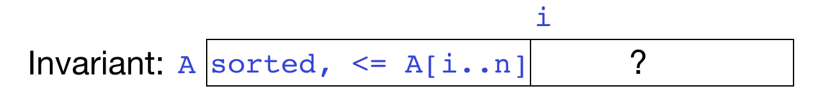

# Lecture 3 - Problems

#### Goals:

* Understand the best and worst-case runtime analysis of insertion sort and selection sort.

#### Problems:

1. Give the worst-case asymptotic runtime class for the following operations on a singly linked Linked List.

   a. inserting an element at the beginning of the list
   b. inserting an element at index `i` in the list
   c. finding an element in the list
   d. finding an element in the list if it's sorted

2. Recall that my made-up `Drawer` abstract data type has two operations: `add` and `find`. Here's a slightly more precise definition of the `Drawer` data type:

   ```java
   /** A container that holds documents, each represented by a String.
     * Class invariants: 
     *  - no two documents in the drawer can be identical;
     *  - null is not a valid document */
   interface Drawer {
      /** Add the given document to the drawer. If an identical document
        * is already in the drawer, this does nothing. 
        * Precondition: document is not null.*/
      public void add(String document);
      
      /** Return whether the given document is in the drawer. 
        * Precondition: document is not null. */
      public boolean find(String document);
   }
   ```

   In case you haven't seen it, this is an example of an **interface**, which is a Java language construct designed to specify a class's interface but not its implementation: the method headers and specs are included, but the code to implement them is not. If a class *implements* an interface, the compiler makes sure that it has implementations for all the methods in the interface.

   In the lecture video, I gave the worst-case runtimes for `add` and `find` for a Drawer that stores elements in either a sorted or an unsorted array. Suppose instead we store the `Drawer`'s contents in a singly linked list. Fill in the table below with the worst-case runtime class for `find` and `add` in a `Drawer` backed by a sorted linked list and an unsorted linked list.

   |        | **UnsortedLinkedListDrawer** | SortedLinkedListDrawer |
   | ------ | ---------------------------- | ---------------------- |
   | `add`  |                              |                        |
   | `find` |                              |                        |

3. In the lecture video, I developed pseudocode for insertion sort from the loop invariant. Here it is again:

   ```java
   /** Sort A using insertion sort */
   insertionSort(A):
     i = 1;
     while i < A.length:
       j = i;
       while j > 0 and A[j-1] > A[j]:
         swap(A[j], A[j-1])
         j--
       i++
   ```

   Give the worst-case and best-case big-O runtime complexity of insertion sort.

4. In this problem, you'll develop the Java code for selection sort. Here's the high-level pseudocode from the slides:

   ```java
   /** Sort A using selection sort */
   selectionSort(A):
     i = 0;
     while i < A.length:
       find minimum value in A[i..A.length]
       swap it with A[i]
       increment i
   ```

   and here's the loop invariant:

   

   Develop java code for selection sort based on this loop invariant. You may find it helpful to implement a helper method to find the minimum value in a range of an array. If you write a helper method, make sure it has a precise specification.

5. What is the worst-case asymptotic runtime class of selection sort?


