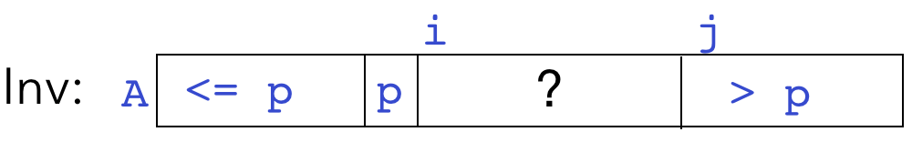
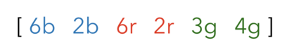

# Lecture 6 - Problems

1. Here's the invariant for `partition` again:

   

   and here's the pseudocode:

   ```java
   void partition(A, start, end)  
     initialize i, j
     choose pivot
     swap pivot to A[start]
     while [?] section != []
       # process A[i]:
       if <= p:
         grow <= p section
       else:
         grow > p section 
   ```

   Write more detailed pseudcode for the `if/else` block inside the `while` loop. What needs to be done, in terms of elements and indices in `A`, to grow one section or the other?

2. How could you choose a pivot that would guarantee a total of O(log n) levels of partitioning? Why isn't this a good idea?

3. Run insertion sort on the following input array, sorting on only the digit value. Is insertion sort stable?

   

4. Run selection sort on the same input array above, sorting on only the digit value. Is selection sort stable?

5. Which of the four sorting algorithms we've covered are **in-place**?

6. Is merge sort stable?

7. Is quicksort (as presented in lecture) stable?

8. What is the space complexity of quicksort?

