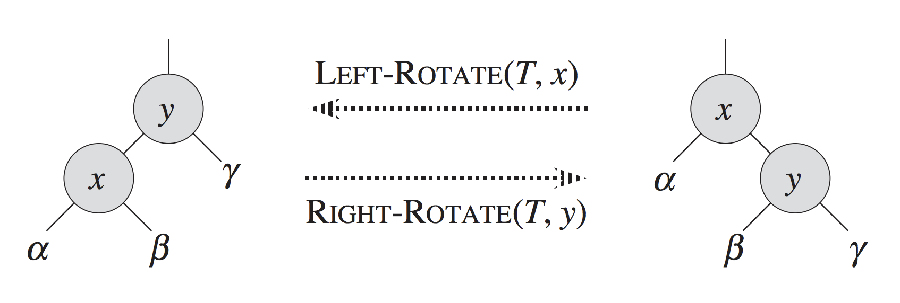

# Lecture 10 - Problems

1. What is the precondition for performing a left rotation on a node? What about for a right rotation?

2. Suppose you are implementing a `TreeSet` - an implementation of the Set ADT where each value is stored in a node of a binary search tree. If you want to make the `TreeSet` generic, what if any restrictions must be placed on the type parameter for this to work?

3. Give a sequence of rotations that can be applied to the following tree such that 11 becomes the root. Each rotation should be specified as a direction with a node as its argument, such as `left(10)`.

   

4. I claimed that tree rotations do not violate the BST property, but I didn't prove it. Based on the diagram below, explain why values in subtrees $\alpha$, $\beta$, and $\gamma$ cannot violate the BST property after a left rotation if they did not violate it before.

   

5. For each of the following trees, calculate the balance factor of every node, then find the shortest possible sequence of rotations (if any) needed to achieve a tree whose nodes all have balance factors no smaller than -1 and no larger than 1.

   